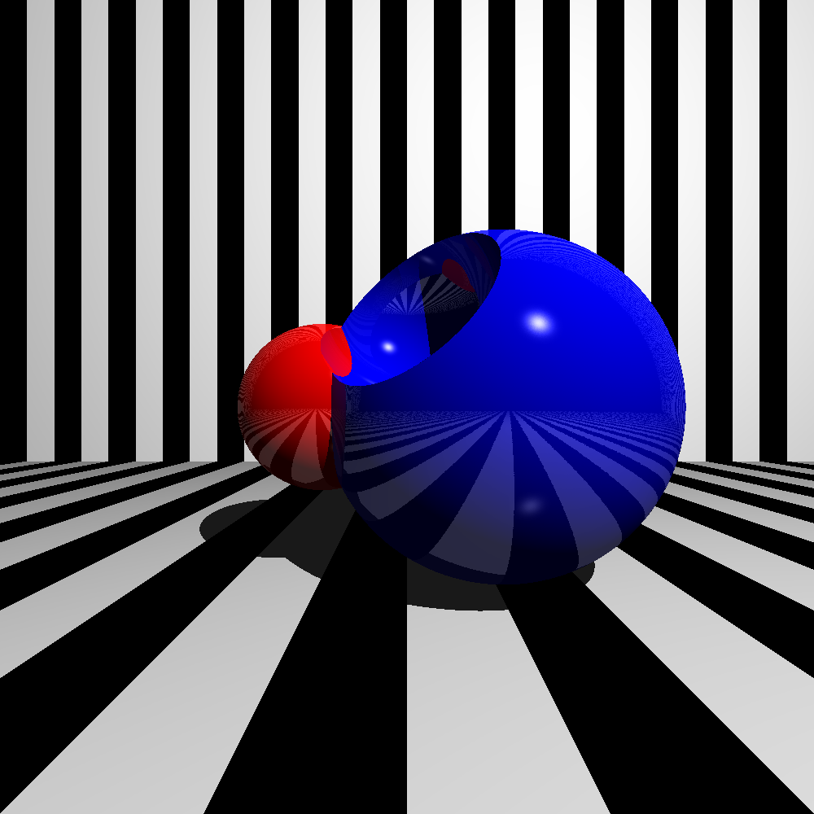

# rendrs

`rendrs` is a poorly named ray-marching raytracer. It has a scene description
language that's s-expression based, and documented in the language section.

## Examples 

`cargo run --release -- render scenes/complicated.scene`



## Running

`rendrs` can be run in one of two modes, as an offline renderer that will output
the render targets of the scene description, or in an interactive mode where it
will refresh the render targets in a web-browser window as the scene description
is edited and saved.

The first mode is run via the `render` sub-command. It expects a scene file as
an argument, and has an optional `--threads` argument to control the number of
threads spawned during rendering.

The second mode is run via the `serve` sub-command. It will watch the scene file
provided, and will open your web-browser to `http://127.0.0.1:8080` when
started. The port used can be controlled via the `--port` argument, and the
`--threads` argument is also valid here.

## TODO

* [ ] Transparent objects
* [ ] Global illumination integrator
* [ ] Sub-pixel sampling strategies
* [ ] Handle non-square pixels for ascii rendering
* [ ] `.obj` file mesh loading

## Language

The scene description language is made up of s-expressions. Top-level
declarations are used to define nodes, lights, patterns, materials, and cameras,
which are all used by render targets to produce a final output.

Single-line comments start with the `;` character.

The following conventions are used in the descriptions below:

* `<name>` - an identifier, starting with a lower-case ascii letter, followed by
  ascii letters, digits or the symbols `-`, `_`, `!`, or `?`
* `<number>` - a number, with an optional decimal component
* `<vector>` - a three dimensional vector, specified as `(<x> <y> <z>)`, where
  each of the components are expected to be number literals
* `<point>` - a three dimensional point, specified in the same format as
  `<vector>`
* `<string>` - a double-quoted string
* `<symbol>` - the same format as `<name>`, but with a leading `:`
* `<color>` - a hex color, specified as `#rrggbb`
* `<angle>` - either a number specifyin the value in radians, or
  `(degrees <number>)` to specify it in degrees.

### Nodes

Node declarations take the form:

```lisp
(node <name> <shape-description>)
```

The following shape descriptions are available:

* `(plane <vector>)` - a plane whose normal is given by the vector.
* `(sphere <number>)` - a sphere whose radius is given by the number.
* `(box <number> <number> <number>)` - a box whose width, height, and depth are
  given by the three numeric literal arguments.
* `(torus <number> <number>)` - a torus with the given hole diameter, and outer
  radius.
* `(group <node>...)` - Group together the following nodes into one node. The
  nodes can be either inlined shape definitions, or the names of nodes
  introduced through a top-level `(node ...)` declaration.
* `(union <node>...)` - Union together nodes. This behaves similarly to
  `(group <node>...)`, but the difference is that for material application it's
  considered to be a single object, wheras the members of a group are still
  considered to be separate objects.
* `(smooth-union <number> <node>...)` - Union the nodes together, but smoothly
  blend between the nodes according to the numeric parameter given.
* `(subtract <node> <node>)` - Subtract the second node from the first. The
  material from the second node will be used as the material for the cutout,
  giving some control over how the removal looks.
* `(intersect <node>...)` - The intersection of all of the objects.
* `(transform <transform> <node>)` - Apply the given transform to the node when
  rendering it.
* `(paint <material> <node>)` - Apply the given material to the node when
  rendering.

### Transforms

Transforms can be used to transform nodes or patterns in the scene graph during
rendering.

* `(compose <transform>...)` - Compose all the transformations left-to-right.
* `(rotate <vector>)` - A rotation specified in axis-angle notation.
* `(uniform-scale <number>)` - Uniform scaling in all dimensions.
* `(scale <vector>)` - Non-uniform scaling in all dimensions. WARNING: this
  doesn't function exactly correctly for SDFs, and may have unexpected behavior
  as a result.
* `(look-at <point> <point> <vector>)` - Compose the look-at transform to orient
  the first point, the eye, towards the second point, the target. Especially
  useful for orienting cameras.

### Lights

Lights can be added to the scene with a `light` declaration:

```lisp
(light <light>)
```

The light value can take one of the following forms:

* `(diffuse <color>)` - A diffuse light applied to the entire scene.
* `(point <color> <point>)` - A point light with the given color, positioned at
  the point.

### Patterns

Patterns can be declared with the following form:

```lisp
(pattern <name> <pattern>)
```

The pattern values can take one of the following forms:

* `(solid <color>)` - The solid color pattern.
* `(gradient <color> <color>)` - Blending between the two colors given the
  object-space coordinate's x-value.
* `(stripes <pattern> <pattern>)` - Alternating between the two patterns in
  vertical stripes, based on the object space coordinate's x-value.
* `(checkers <pattern> <pattern>)` - A checkerboard pattern that alternates
  between the two patterns. The checkers are three-dimensional volumes, so
  they're more like cubes in space.
* `(shells <pattern> <pattern>)` - Rings of alternating patterns, centered at
  the origin.
* `(transform <transform> <pattern>)` - Apply the transformation to the
  object-space point before determing the color produced by the sub-pattern.

### Materials

Materials can be declared with the following form:

```lisp
(material <name> <material>)
```

The material values can take one of the following forms:

* `(phong <args>)` - The Phong reflection model, with the following arguments:
  * `:pattern <pattern>` - (required) the pattern to use for the surface
  * `:ambient <number>` - (default `0.1`) the ambient light contribution,
    `[0,1]`
  * `:diffuse <number>` - (default `0.9`) the diffuse light contribution,
    `[0,1]`
  * `:specular <number>` - (default `0.9`) the specular light contribution,
    `[0,1]`
  * `:shininess <number>` - (default `200`) the specular light contribution
  * `:reflective <number>` - (default `0`) how reflective the surface is,
    `[0,1]`
* `(emissive <pattern>)` - The surface behaves as a light source. This is
  currently not very helpful, as the only integrator available is a Whitted
  ray-tracer, that doesn't handle emissive objects well.

### Cameras

Cameras can be declared at the top-level with the following form:

```lisp
(camera <name> <camera>)
```

There is currently only one type of camera, a `pinhole` camera. It takes the
following form:

```lisp
(pinhole <number> <number> <transform> <angle>)
```

The first two numbers are width and height of the canvas produced, the transform
is the world-to-camera transform, and the last angle is the field of view of
the transform.

### Render Targets

Render targets are declared as follows:

```lisp
(render <target> <integrator> <node>)
```

`<target>` is one of the following forms:
* `(file <string>)` - write the output to the file specified in the string
* `(ascii <string>)` - Render the output as ascii, and use the string name to
  disambiguate it from other `ascii` targets.

There is currently only one `<integrator>` supported, the `whitted` integrator.
It takes as an argument a `<sampler>` and `<camera>` value. The only sampler
currently implemented is the `(uniform <number> <number>)` sampler, where the
two numeric parameters are the number of horizontal and vertical samples to
collect for a single pixel.

Finally, the `<node>` argument will be the root of the scene, and only nodes
reachable from that node will be rendered.
