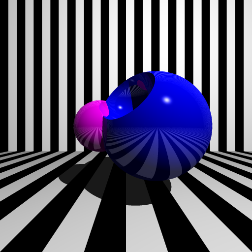

# rendrs

A ray-marching based ray-tracer written in rust.

## Examples

```sh
$ cargo run --release scenes/complicated.yaml output.png
```




```sh
$ cargo run --release scenes/refraction.yaml output.png
```


```sh
$ cargo run --release scenes/csg.yaml output.png
```


```sh
$ cargo run --release scenes/teapot.yaml output.png
```


